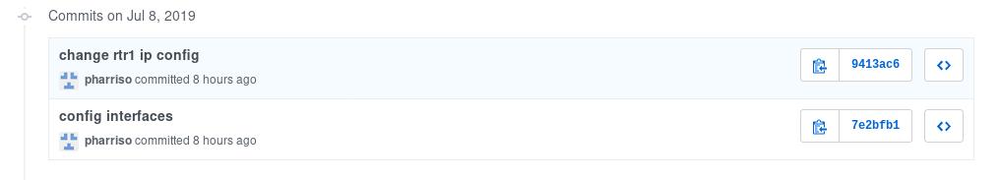
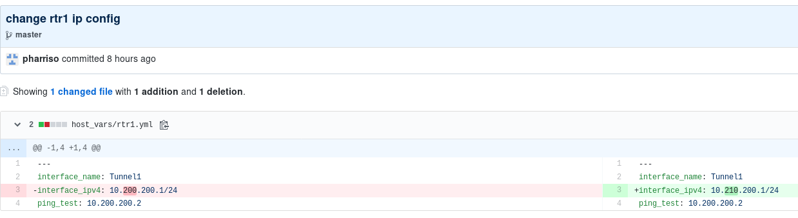

# Exercise 4-6: Network Testing with Tower Workflows

## Table of Contents

- [Objective](#objective)
- [Guide](#guide)
- [Solution](#solution)

# Objective

In this exercise we will do some more configuration rollout and testing. This time we will pull our config from source control and use the ios_ping module to test connectivity to a peer router interface. Again, we will rollback our config if our testing fails - this time using the ios archive function.

# Guide

## Step 1:

We are going to run an Ansible playbook to build this workflow in Tower. On your Tower node, run the following commands to download the playbook and workflow schema.

```bash
cd ~/networking-workshop
curl -O https://raw.githubusercontent.com/pharriso/tower_workshop/master/tower_workflow.yml
curl -O https://raw.githubusercontent.com/pharriso/tower_workshop/master/files/workflow.json
```

## Step 2:

Edit the tower_workflow.yml playbook using your prefered editor and set the **tower_password** var so it contains the correct admin password for your Tower instance. 

Now run the playbook to create the necessary job templates and workflow in Tower.

```bash
ansible-playbook tower_workflow.yml
```

You should have a number of new job templates including a workflow called **NETWORK INTERFACE WORKFLOW** in the **templates** section of the Tower UI.

## Step 3

Ansible Tower has been pulling our playbooks from source control - github in our case. We can also store our router configs and associated variables in source control as well so we get all of the same benefits - history, ability to create feature branches and peer reviews etc.

We have a basic example of a router interface variable being stored in github. Take a look at the history of this file - **https://github.com/pharriso/tower_workshop/commits/master/host_vars/rtr1.yml**



Now click on the **change rtr1 ip config** link. We can see the changes that have been made and who commited it.



## Step 4

Now let's run the workflow. In the Tower UI, select **Templates** in the left-hand pane. Then press the **launch** icon next to our **NETWORK INTERFACE WORKFLOW**. You should see the workflow set up archives on the Cisco routers. We then re-configure the interface on rtr1 **incorrectly** and fail our ping tests. The config is then restored from the archive before we re-test. As we saw earlier, the history of the actual config changes are in git so we can see what mistakes were made in configuring the router interface and can see the user who made that update. So we now have the full audit trail from config all the way through to the automation execution.

# Solution
You have finished this exercise. Once again, we have used Ansible to make changes to our devices and performed some basic testing to determine if we should rollback our changes.

[Click here to return to the lab guide](../README.md)
