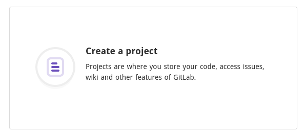
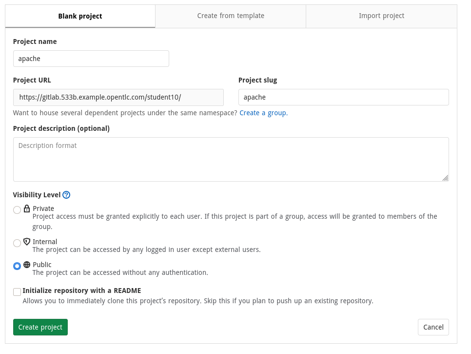
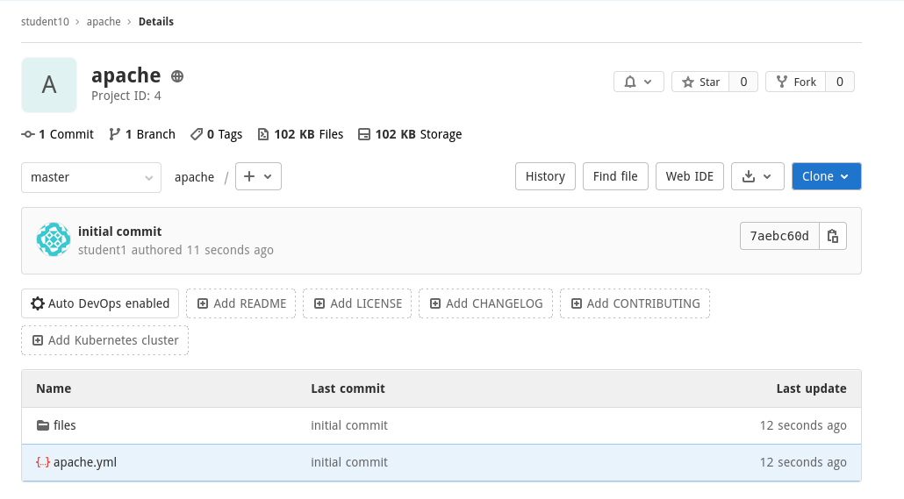

# Exercise - Ansible Tower as part of a CI/CD pipeline

We are going to use our Install Apache example again but integrate it with our CI/CD pipeline to automatically deploy our website.

## Create a gitlab repository

Select **Create a Project**



Name the project **apache** and make sure the repository is set to **public**



Finally, click **Clone** and then copy the **Clone with HTTPS** by clicking on the clipboard icon next to **Clone with HTTPS**.


## Creating our playbook

As your student user, log onto ansible-1 and clone the repo

```bash
cd ~
git clone https://gitlab.533b.example.opentlc.com/student10/apache.git
```

Output:

```bash
Cloning into 'apache'...
warning: You appear to have cloned an empty repository.
```

We are going to re-create the Install Apache playbook and push this to our git repo. Change directory to the newly cloned apache directory.

```bash
cd ~/apache
```

Create the playbook ~/apache/apache.yml with the following contents:

```bash
---
- name: Apache server installed
  hosts: web
  become: yes
  tasks:
  - name: latest Apache version installed
    yum:
      name: httpd
      state: latest
  - name: Apache enabled and running
    service:
      name: httpd
      enabled: true
      state: started
  - name: copy web.html
    copy:
      src: web.html
      dest: /var/www/html/index.html
```

Next create a directory for the index.html:

```bash
mkdir ~/apache/files
```

Finally, create ~/apache/files/web.html 

```bash
<body>
<h1>Automating is fun</h1>
</body>
```

Quickly run the playbook to make sure it works:

```bash
ansible-playbook apache.yml
```

## Push the playbook to git

Now that we know the playbook works, we can push it to git. 

```bash
cd ~/apache
git add .
git commit -m "initial commit"
git push
```

If you check the gitlab repository in your web browser, you should now see your files.



## Create a playbook to configure Ansible Tower

Now that we have our playbook, we are going to write a second playbook that will create the necessary objects in Ansible Tower to allow us to execute our job. As the student user on the ansible-1 create a directory for the Tower configuration:

```bash
mkdir ~/apache/tower_config
```

Now create a playbook that will define a new project with this new gitlab repository, define the job template and finally launch the job. The playbook should be called  ~/apache/tower_config/tower.yml and contain the following:

**NOTE - update the tower_git_url the https url you used to clone the gitlab repository**

```bash
--- 

- name: Create Ansible job and launch it
  hosts: localhost
  gather_facts: false
  vars:
    tower_project_name: "apache project"
    tower_organization: Default
    tower_git_url: changeme!!!!!
    tower_inventory: "Workshop Inventory"
    tower_job_name: "CI Apache Install"
    tower_playbook_name: apache.yml
    tower_become_enabled: true
    tower_host_limit: web
    tower_credentials:
      - "Workshop Credential"
  tasks:
  - name: Create Project in Ansible Tower
    awx.awx.tower_project:
      name: "{{ tower_project_name }}"
      organization: "{{ tower_organization }}"
      scm_type: git
      scm_clean: true
      scm_delete_on_update: true
      scm_update_on_launch: false
      scm_url: "{{ tower_git_url }}"
      state: present

  - name: Update Project in Ansible Tower
    awx.awx.tower_project_update:
      project: "{{ tower_project_name }}"

  - name: Create Job Template in Ansible Tower
    awx.awx.tower_job_template:
      name: "{{ tower_job_name }}"
      job_type: "run"
      organization: "{{ tower_organization }}"
      inventory: "{{ tower_inventory }}"
      project: "{{ tower_project_name }}"
      playbook: "{{ tower_playbook_name }}"
      limit: "{{ tower_host_limit }}"
      become_enabled: "{{ tower_become_enabled }}"
      credentials: "{{ tower_credentials }}"
      state: "present"

  - name: Launch Job Template in Ansible Tower
    awx.awx.tower_job_launch:
      job_template: "{{ tower_job_name }}"
      wait: true
```

## Test the playbook

Make sure you still have your Tower environment variables set so we can authenticate to the Tower API (replace **yourpassword** with the correct password):

```bash
export TOWER_USERNAME=admin && export TOWER_PASSWORD=yourpassword && export TOWER_VERIFY_SSL=false
```

```bash
ansible-playbook tower_config/tower.yml
```

Check in the Tower UI to see the objects we have created. The **CI Apache Install** job should have run succesfully. If it has then push your changes to git.

## Push changes to git

```bash
cd ~/apache
git add .
git commit -m "Add Tower playbook"
git push
```

## Integrate with Gitlab CI/CD

Still to write

## Summary


---

[Click Here to return to the Ansible Tower Workshop](../README.md)
