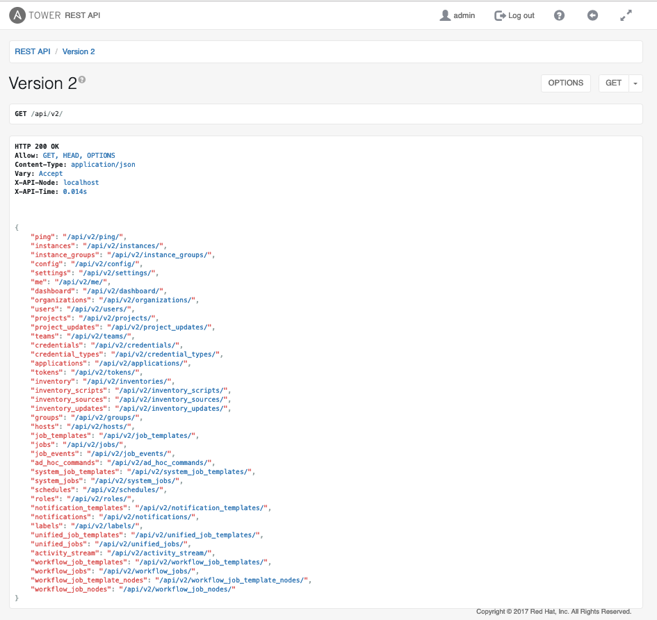
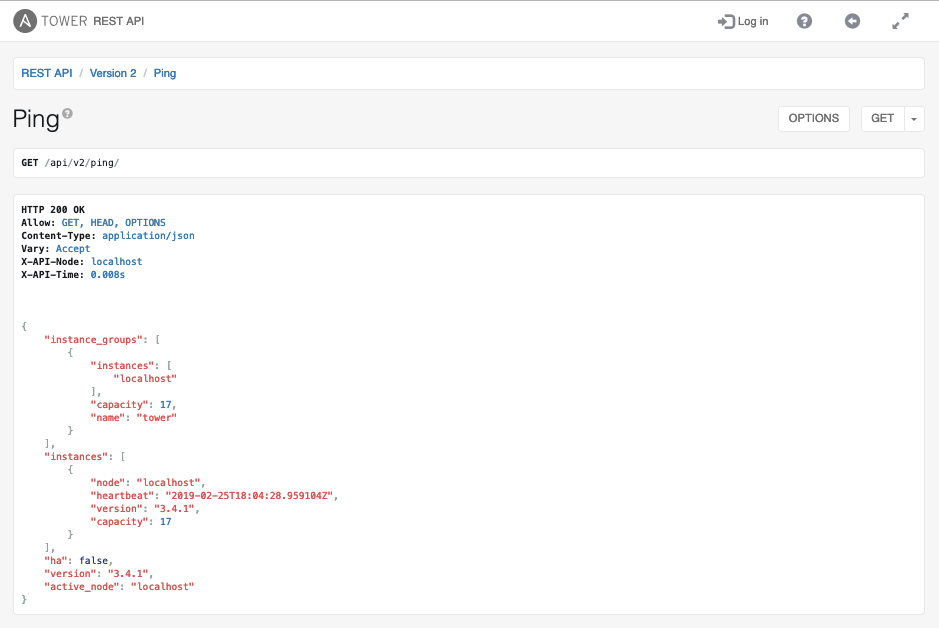
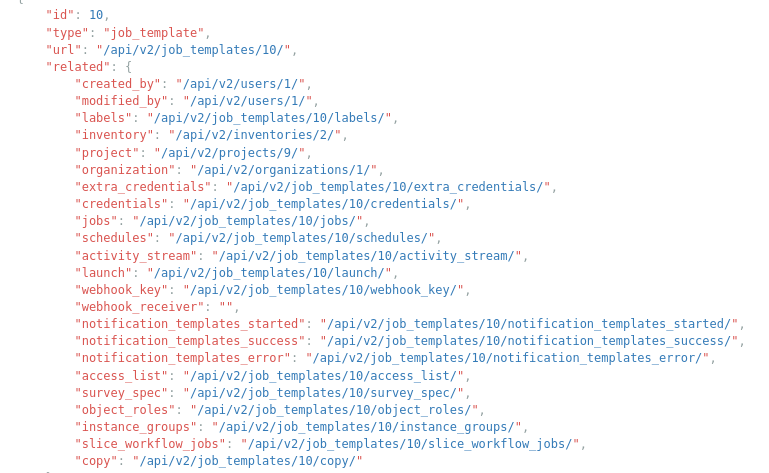

# Exercise - Tower API

Ansible Tower has a RESTFUL API that allows us to move away from CLI driven automation to API driven automation. This workshop will allow us to explore how we can interact with that API.

## Why would I want to use the Tower API?

Ansible Tower provides a central platform for executing Ansible playbooks. It solves a number of challenges that one must overcome before using automation in a production environment. By leveraging Ansible Tower, customers can solve these problems once but consume it many times. This could include engineers directly interacting with the Tower UI or consuming it via the API from 3rd party systems like ServiceNow or CI/CD pipelines. Some of the things that one must solve include:

* **High Availability** Providing a highly-available automation platform.
* **Scale** Being able to automate across 1000's of endpoints.
* **Audit** Who is automating? What are they automating against? Are jobs running succesfully?
* **Scheduling** How do you schedule jobs? Do they need to run out of hours?
* **Credential Management** Being able to safely store credentials and control access to them or integrate with a secret management system like Hashicorp Vault or CyberArk.
* **Role-Based Access Control** Who can automate? What can they automate against? What credentials are they allowed to use? 

Ansible Tower provides all of these features and integrations out of the box and allows you to consume them in a way that best suits your use-case via an API.

## Explore the API

To explore the API navigate to https://**public_IP**/api/v2/ where **public_IP** is the public IP of your Tower instance.

Feel free to click on other links within the API to see all of the objects that are available.

## Calling the API to check status:

Calling the API ping can be a useful 'health' check. https://**public_IP**/api/v2/ping/

## Review job templates

Everytime we create an object in Tower, it automatically creates the API endpoint to allow us to interact with it. Navigate to **api/v2/job_templates** to see all of the job templates you previosuly created in the Tower UI.

Note the **launch** API which we can use to launch jobs. We'll look at this in the next exercise.

---

[Click Here to return to the Ansible Tower Workshop](../README.md)
