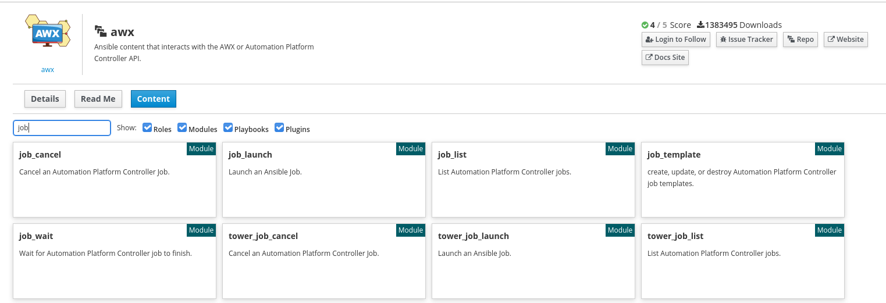

# Exercise - Automating Tower with Ansible

So far we have managed Tower using the UI, the API and the Tower CLI utility. Next we are going to look at how we can use Ansible itself to manage Ansible Tower. We provide an Ansible collection to allow customers and users to automate Tower with Ansible. This allows customers to automate Tower in exactly the same way they are automating the rest of their infrastructure - with the same common language. The Ansible Tower content collection provides a way to create, update or delete objects as well as perform tasks such as run jobs and configure Ansible Tower. 

As with everything at Red Hat, we provide an upstream community collection called awx.awx and a downstream supported collection for Red Hat Ansible customers called ansible.tower. There is a nice [blog post](https://www.ansible.com/blog/introducing-the-awx-collection) which talks through the content collections in more details with some examples.

### Installing the collection

We are going to install the awx.awx collection because the lab environment doesn't provide access to the certified content in [Automation Hub](https://www.ansible.com/products/automation-hub). 

As the student user on ansible-1 run the following:

```bash
ansible-galaxy collection install awx.awx:19.1.0
```

With the collection installed we can look at the contents of the collection on Ansible Galaxy as well as find links to documentation. Click [here](https://galaxy.ansible.com/awx/awx) to see the collection details.



To view the documentation for a module from the command line run the following:

```bash
ansible-doc awx.awx.tower_organization
```

### Authenticating with the Tower modules

There are different ways of configuring authentication for the Tower modules. We will eventually be running our Tower configuration as part of a CI/CD pipeline so we'll use environment variables to set our authentication. As your student user on ansible-1, run the following commands to set the username and password. Replace **yourpassword** with the admin password.

```bash
export TOWER_USERNAME=admin && export TOWER_VERIFY_SSL=false && export TOWER_PASSWORD=yourpassword
```

### Writing our first playbook to automate Tower

We are going to write a simple playbook to show how we can use Ansible to interact with Ansible Tower. As your student user on ansible-1 run the following to get into the right directory:

```bash
cd ~/ansible-files/
```

**NOTE if you didn't work through section 1 of the lab guide then you may need to first create the directory**

```bash
mkdir ~/ansible-files/
cd ~/ansible-files/
```

Create a new file called **tower_job_launch.yml** using your favourite editor and add the following contents:

```bash
---

- name: launch a tower job
  hosts: localhost
  gather_facts: false
  tasks:
  - name: launch Install Apache job
    awx.awx.tower_job_launch:
      job_template: "Install Apache"
      wait: yes
```

### Running the playbook

Make sure your environment variables are still set to allow us to authenticate to Tower. If you are unsure then run the following again (make sure you replace **yourpassword**):

```bash
export TOWER_USERNAME=admin && export TOWER_VERIFY_SSL=false && export TOWER_PASSWORD=yourpassword
```

Now let's launch our job:

```bash
ansible-playbook tower_job_launch.yml 
```

The output should look like this:

```bash
PLAY [launch a tower job] ********************************************************************************************************************************************************************

TASK [launch Install Apache job] *************************************************************************************************************************************************************
[WARNING]: You are using the awx version of this collection but connecting to Red Hat Ansible Tower
changed: [localhost]

PLAY RECAP ***********************************************************************************************************************************************************************************
localhost                  : ok=1    changed=1    unreachable=0    failed=0    skipped=0    rescued=0    ignored=0
```

Note the warning message which says we are running the community content version against a production Ansible Tower instance.

You can check in the Tower UI to validate if your job ran successfully. 

## Summary

We have now looked at four different ways of interacting with Ansible Tower to do the same thing - launch a job. The UI, directly with the API, Tower CLI and finally the Ansible Tower modules. This gives users the flexibility to consume the Ansible Automation Platform in the way that best suits their use-case. In the next lab we are going to look at a more complete example and how we can configure larger parts of Ansible Tower with the Ansible modules.

---

[Click Here to return to the Ansible Tower Workshop](../README.md)
